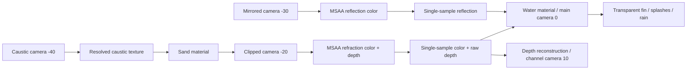

# Multipass water

这是原生 Cocos Code First 场景：`Node`、`Camera`、`MeshRenderer`、`Material` 和 `RenderTexture`。没有 Three.js、模型或预渲染图片依赖。

启动 `npm run dev -- --example water-multipass`。构建 SDK 后再启动；本例要求 `createAirRenderTarget` 接口。默认相机 `(7.8, 6.1, 9.2)`、时间 `1.25s`、波种子 `1.7`；初始暂停以便重复截图。点击 Play 启动，Reset 恢复固定状态。移动真实指针会通过相机射线和水面交点生成局部波纹、水花；Rain 开关同时控制实际雨滴网格和共享波函数的环状水面扰动。

| 通道       | 实际输入与输出                                                          | 相机优先级 |
| ---------- | ----------------------------------------------------------------------- | ---------- |
| Caustics   | 三组解析波法线，折射方向与池底落点 Jacobian；独立 `512×512` RGBA16F     | -40        |
| Reflection | 镜像相机，岸上物体、含跨水面的木柱；斜近裁剪保留水面以上                | -30        |
| Refraction | 主视点相机，沙、石、鱼、木柱；反向斜裁剪保留水面以下                    | -20        |
| Depth      | 折射通道真实 depth24-stencil8 附件，resolve 后 raw `sampler2D`          | 与折射同帧 |
| Final      | 10,201 顶点真实波面，反射/折射、Fresnel、深度吸收与泡沫；透明鱼鳍和水花 | 0          |
| Viewer     | 调试通道真实纹理；Depth 反投影后显示线性视空间距离                      | 10         |

Reflection/Refraction 请求 RGBA16F、4×MSAA、0.75 缩放；`sampleFallback:'lower'` 允许明确降采样，状态栏与 `__probe()` 显示**实际**格式、尺寸和样本数。没有 HDR 格式支持时明确失败，不能把 RGBA8 静默当 HDR。折射深度不是RGB图案：从 `.r` 读取深度，WebGL2 `[0,1]` 转 clip `[-1,1]`，乘同次斜投影的逆视投影，再除 w。水面到重建接收点的世界距离驱动 Beer–Lambert 吸收，线性深度查看使用 `-viewPosition.z`。

斜裁剪回调在每个相机开始、culling/UBO 上传之前运行，先重建普通投影避免累计斜切。原生 `calculateObliqueMat()` 必须同时更新相关逆矩阵与视锥。窗口 resize 调用目标 `resize()`；`bindColor/bindDepth` 持有的绑定应自动换到新附件，不能继续采样旧 GFXTexture。

透明叠加材质采用 `SRC_ALPHA/ONE_MINUS_SRC_ALPHA`，`depthTest=true`、`depthWrite=false`。实际几何包含一个鱼鳍、12 个水花片和24个可开雨滴。透明队列在水面不透明合成之后；鱼鳍 priority1、水花 priority2。这里不宣称交叉透明几何的全局排序或 OIT；各片是独立小网格，仍遵循 Cocos 队列与深度测试。

焦散采用固定水平池底 y=-2 的折射光线落点面积近似：在水面坐标上用有限差分求 landing Jacobian，再把落点真实网格渲染到离屏目标，最后投影到沙面。它不是通用焦散光追；岩石未接收该平面焦散，波幅和高度范围有限。反射/折射是固定水面 y=0 的平面镜近似，不是SSR，波峰不会逐片改变剪裁面。

GLSL 源位于 `shaders/`。运行 `node examples/water-multipass/generate-effects.mjs` 生成并登记确定内容哈希的五份原生 effect JSON；工具依赖已有受限 effect 生成器，明确支持 vec4/mat4 UBO 和 fragment sampler2D，不是通用 Cocos `.effect` 编译器。GLSL3/4 同源，Cocos 注入版本头。

控制接口：`window.__water.setTime(2)`、`setChannel('depth')`、`setFlag('reflection',false)`、`setParameter('waveAmplitude',0.08)`、`setParameter('distortion',0.035)`、`setParameter('absorption',1.5)`、`targets()` 和 `matrices()`；`window.__probe()` 提供实际附件与几何、相机优先级、blend/depthWrite状态。`__lifecycle()` 真实执行释放和重建。字段与成功初始化不能代替像素验收。

相机 BEGIN 回调晚于模型 UBO 的本帧上传。示例在回调中写入投影相关材质参数后明确执行 `material.passes[].update()`，保证水面、深度重建和查看器使用**本帧**矩阵，避免相机移动或 resize 时读前一帧 UBO。

验证：`node examples/water-multipass/verify-browser.cjs --url=http://127.0.0.1:7454/examples/water-multipass/ --browser=chromium --out=output/water-multipass/chromium`。`--browser` 也支持 `firefox` 与 `webkit`，报告与截图应分别放到各自目录。默认只做独立 GLSL 编译/链接检查；带 URL 才执行真实场景、各通道输出、固定状态、鼠标、雨、resize 和 lifecycle，每次捕获都检查真实 WebGL error queue。CPU 回调计数不代表GPU耗时或屏幕 present 性能。
